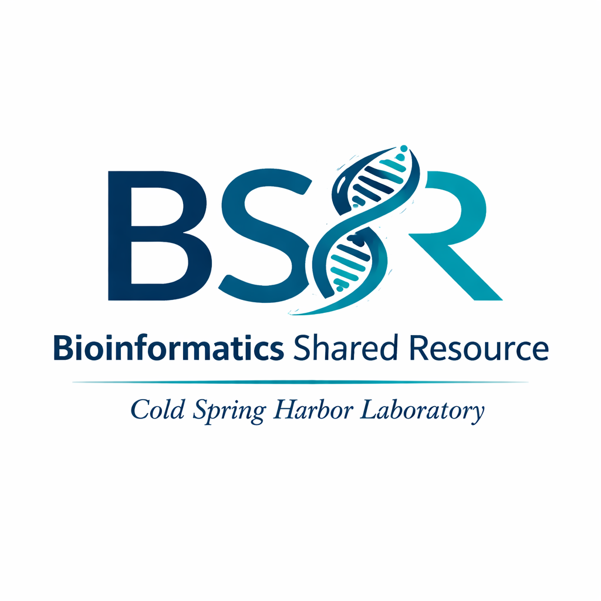

<div align="center">



# Bioinformatics Teaching Materials

Workshops, slides, notebooks, and reusable teaching scripts for computational biology, genomics, statistics, R, Python, and machine learning.

</div>

---

## Contents

| Topic | Materials |
| --- | --- |
| Python | Introductory Python workshop slides, notebooks, practice notebook, and solutions |
| R | Hands-on R workshop slides, R scripts, CPM practice materials, and small example count matrices |
| Machine learning | Workshop slides and notebooks covering decision trees, random forests, SVMs, hierarchical clustering, and model practice |
| Single-cell RNA-seq | scRNA-seq best-practices slides and a reusable starter analysis template |
| Genomics best practices | RNA-seq, ATAC-seq, ChIP-seq, WGS/WES, long-read sequencing, biostatistics, and experimental design slide decks |

## Repository Layout

```text
.
├── assets/
├── genomics_best_practices/
│   └── slides/
├── machine_learning/
│   ├── notebooks/
│   └── slides/
├── python/
│   ├── notebooks/
│   └── slides/
├── r/
│   ├── data/
│   ├── scripts/
│   └── slides/
└── scrna/
    ├── scripts/
    └── slides/
```

## Suggested Use

- Start with the slide deck for the topic.
- Use the notebooks or scripts as live-coding material.
- Use the practice notebooks and small example datasets for hands-on exercises.
- Adapt the best-practices decks for project onboarding, consultation, or short-format training.

## Topics Covered

### Programming

- Python basics for scientific computing
- R basics for tabular data, plotting, and count-matrix handling
- Reproducible scripts and notebooks

### Genomics

- RNA-seq experimental design and analysis concepts
- ATAC-seq and ChIP-seq best practices
- WGS/WES analysis concepts
- Long-read sequencing considerations
- Single-cell RNA-seq QC, clustering, annotation, and interpretation

### Statistics And Machine Learning

- Biostatistics and study design
- CPM normalization and simple count-matrix exercises
- Decision trees and random forests
- Support vector machines
- Hierarchical clustering for expression data
- Train/test thinking and model interpretation

## Notes

These materials are intended for teaching, onboarding, and workshop use. Some examples are simplified intentionally so learners can focus on the core computational ideas before moving to full production workflows.
